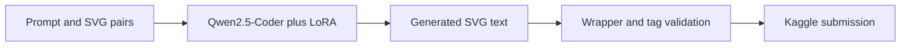

# Text-to-SVG Generation with LoRA

A Kaggle experiment that fine-tunes `Qwen/Qwen2.5-Coder-1.5B-Instruct` with LoRA to generate constrained, renderable SVG markup from text prompts.

## Pipeline



## Canonical experiment

The official experiment is the raw-data, one-pass baseline documented in [`DL_Midterm_Final.ipynb`](DL_Midterm_Final.ipynb). It trains on the original `train.csv` without canonicalization or prompt-conflict resolution, using this text format:

```text
Prompt: {prompt}
SVG:
{svg}
```

Canonical entry points and evidence:

- [`scripts/train_raw_baseline.py`](scripts/train_raw_baseline.py) implements training.
- [`notebooks/kaggle_submit_raw_baseline.ipynb`](notebooks/kaggle_submit_raw_baseline.ipynb) implements offline Kaggle inference and submission generation.
- [`artifacts/raw_baseline_manifest.json`](artifacts/raw_baseline_manifest.json) records the fixed configuration and artifact policy.
- [`kaggle_submission_scores.csv`](kaggle_submission_scores.csv) preserves the available submission history; this README does not attribute a leaderboard result to the canonical run.
- The repository is public at <https://github.com/Demetri65/svg-kaggle-competition.git>.

Exploratory evaluation variants, retry experiments, and earlier workflows are retained under [archive/](archive/) for chronology, not as the official reproduction path.

## Training configuration

- Base model: `Qwen/Qwen2.5-Coder-1.5B-Instruct`
- LoRA rank, alpha, and dropout: `16`, `32`, and `0.05`
- LoRA targets: `q_proj`, `k_proj`, `v_proj`, `o_proj`, `gate_proj`, `up_proj`, and `down_proj`
- Training: `1` epoch, per-device batch size `4`, gradient accumulation `4`, learning rate `2e-4`, cosine schedule, and `warmup_ratio=0.05`
- Runtime: BF16 with `paged_adamw_8bit`, `max_length=1024`, and seed `42`
- Inference: deterministic decoding with `max_new_tokens=1536`

These settings intentionally preserve the original truncated training regime rather than presenting later experiments as the baseline.

## SVG guardrails

The submission notebook extracts SVG markup, normalizes it to a strict `256x256` wrapper with `viewBox="0 0 256 256"`, and checks:

- XML structure and an allowed-tag whitelist
- Renderability through CairoSVG
- A maximum serialized length of `16000` characters
- A maximum of `256` path elements

Invalid generations are rejected or replaced by the notebook's fallback before the Kaggle submission is written.

## Reproduction

1. Install the pinned dependencies in [`requirements.txt`](requirements.txt) on a CUDA-capable environment with `bitsandbytes` support.
2. Place the raw Kaggle `train.csv` in the repository root and provide a local snapshot of the base model.
3. Run the canonical trainer:

   ```bash
   python scripts/train_raw_baseline.py \
     --base-model-dir /path/to/qwen25-coder-1p5b-instruct \
     --output-root runs/raw_baseline
   ```

4. For offline Kaggle inference, attach the dataset, base model, and adapter at the fixed paths documented in [`artifacts/raw_baseline_manifest.json`](artifacts/raw_baseline_manifest.json), then run [`notebooks/kaggle_submit_raw_baseline.ipynb`](notebooks/kaggle_submit_raw_baseline.ipynb).

An existing public artifact folder is hosted on [Google Drive](https://drive.google.com/drive/folders/1UCJATHdn5yBFJJzH_TNXpmjuZBHDgyhX?usp=drive_link).

## Model artifacts

Three large artifact directories are already published in this repository's history and remain tracked by this documentation-only cleanup:

- `svg-lora-adapter/` contains a checked-in adapter bundle.
- `svg-lora-checkpoints/` contains historical training checkpoints.
- `svg-model-merged/` contains the checked-in merged-model metadata files.

The manifest marks the checked-in adapter and merged-model directories as legacy and unverified because their local metadata does not establish lineage to the canonical raw baseline. Future weight bundles should be kept in external storage, following the existing [public Google Drive artifact folder](https://drive.google.com/drive/folders/1UCJATHdn5yBFJJzH_TNXpmjuZBHDgyhX?usp=drive_link), rather than added to Git history.

## Repository structure

```text
.
├── DL_Midterm_Final.ipynb                 # Canonical experiment narrative
├── artifacts/raw_baseline_manifest.json   # Fixed configuration and artifact policy
├── notebooks/kaggle_submit_raw_baseline.ipynb
├── scripts/                               # Training, audit, and submission utilities
├── svg-lora-adapter/                      # Published legacy adapter artifact
├── svg-lora-checkpoints/                  # Published historical checkpoints
├── svg-model-merged/                      # Published merged-model metadata
└── archive/                               # Historical, non-canonical experiments
```

## Limitations

- GitHub reports the repository at approximately 200 MB because large model artifacts are already published in its history.
- Training requires accelerator hardware: the canonical script requires CUDA and a runtime compatible with `bitsandbytes`.
- The canonical training path truncates examples to `1024` tokens, which can discard portions of longer SVG targets.
- Generated SVG remains constrained by syntactic and rendering checks; passing those checks does not guarantee prompt fidelity or visual quality.
- The repository evidence does not tie every checked-in legacy artifact to the canonical raw-data baseline.
